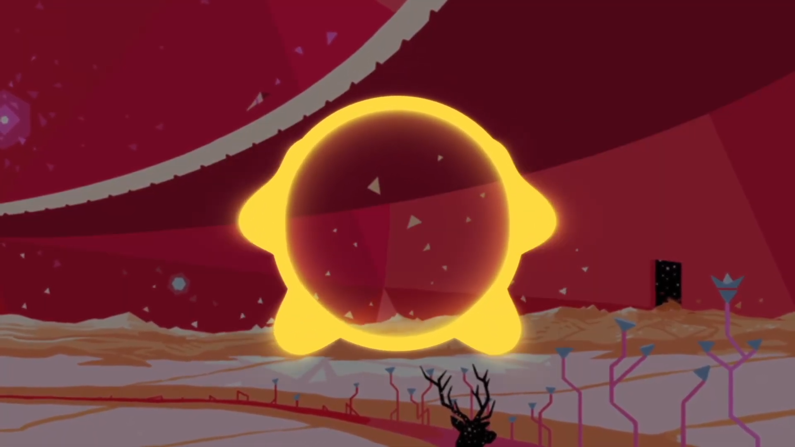

# Music Visualizer

Real-time audio visualizer based on frequency spectrum.

## Web Demo

[music-visualizer.tripplyons.com](https://music-visualizer.tripplyons.com/)

## Video Demo

[](https://www.youtube.com/watch?v=MhHVaCrQ-ZU)

## Development

This project uses Webpack for bundling and development.

### Prerequisites

- Node.js (version 16 or higher)
- pnpm package manager

### Installation

```bash
pnpm install
```

### Development Server

Start the development server with hot reloading:

```bash
pnpm start
```

The application will be available at `http://localhost:8080`

### Building for Production

Build the project for production:

```bash
pnpm run build
```

The built files will be in the `dist/` directory.

## Project Structure

```
visualizer/
├── src/
│   ├── index.html          # HTML template
│   └── index.js            # Main JavaScript entry point
├── static/
│   ├── main.vert           # Vertex shader
│   ├── main.frag           # Fragment shader
│   ├── audio.mp3           # Audio file
│   └── image.png           # Background image
├── webpack.config.js       # Webpack configuration
└── package.json
```

## Features

- Real-time audio frequency analysis using Web Audio API
- GLSL shader-based visual effects
- Responsive canvas rendering
- Audio-reactive zoom effects
- Frequency-based lighting system

## Technologies Used

- Three.js for 3D graphics
- Web Audio API for audio analysis
- GLSL shaders for visual effects
- Webpack for bundling and development
